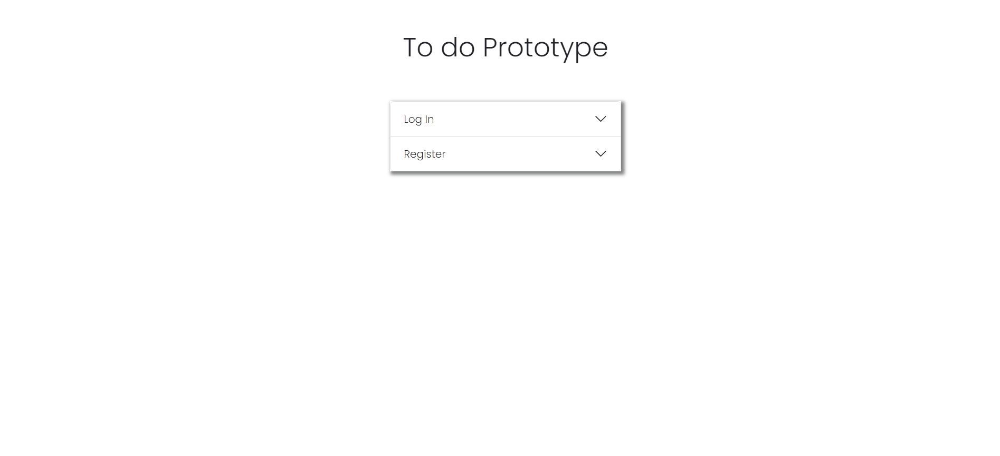
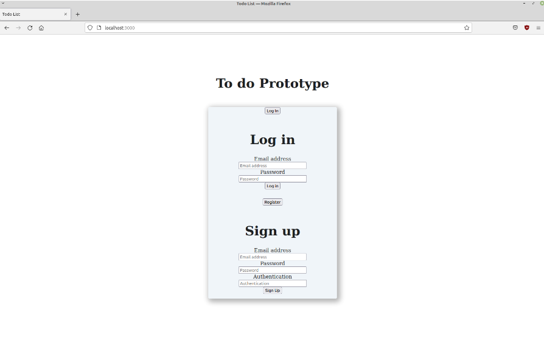
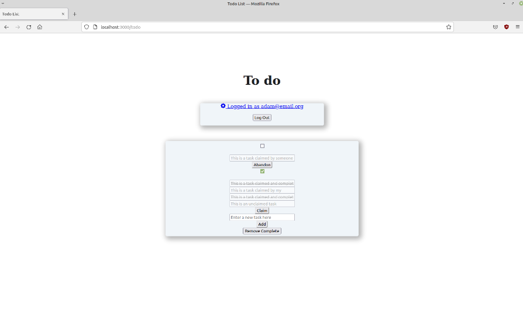

    

 
  

    

 

    <a href="https://todolist.csproject.org/">Final Product (Authentication: todo2023)</a>

 
 

    

 

    The objective is to create a Todo List Application using the MEN stack (Mongo, Express, Node.js) that closely resembles the below prototypes. This application smoothly combines Node.js for robust backend functionality, Express for quick server-side operations, and MongoDB for effective data storage. With tools that make it simple to add, claim, and remove tasks, users will have no trouble browsing through tasks. Data accuracy is ensured via real-time updates, which highlight the MEN stack's strength and adaptability in creating dynamic and responsive online applications.

 

  
  

  
  

 
 

    

<h3 align = "center">Languages</h3>

  
  
  

<h2></h2>

<h3 align="center">Development Tools & Environments</h3>

  
  

<h2></h2>

<h3 align="center">💻 Web Development Frameworks & Libraries</h3>

    
    
    
    
    

<h2></h2>

<h3 align="center">⚡ Databases</h3>

  

<h2></h2>

<h3 align="center">🌐 Web Servers</h3>

  
  

<h2></h2>

<h3 align="center">Hardware and Microcontroller Boards</h3>

  

 

    

 

- <a href="https://adamtilson.github.io/labs/ense-374/lab-2/#">Prototypes</a>

